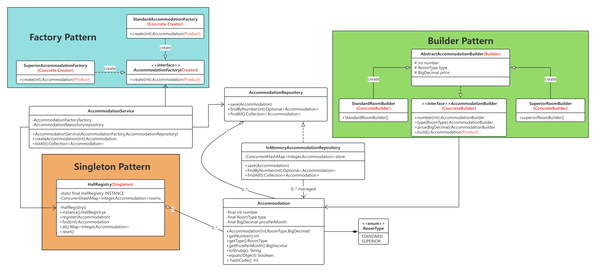

## 主要功能

- 支持标准间和高级间两种房型的创建与管理
- 支持房间的注册、查询、持久化
- 提供内存仓储实现，便于测试和演示

## 采用的设计模式

本项目主要用到以下三种设计模式：

1. **工厂方法模式（Factory Method Pattern）**
   - 通过 `AccommodationFactory` 及其实现类，灵活创建不同类型的房间对象。

2. **建造者模式（Builder Pattern）**
   - 通过 `AccommodationBuilder` 及其实现类，分步骤构建房间对象，支持流式API。

3. **单例模式（Singleton Pattern）**
   - 通过 `HallRegistry` 实现全局唯一的房间注册表，保证数据一致性。

## 关键类说明

- `Accommodation`：领域模型，表示宿舍房间。
- `RoomType`：房间类型枚举（标准间/高级间）。
- `AccommodationFactory`、`StandardAccommodationFactory`、`SuperiorAccommodationFactory`：工厂方法模式相关。
- `AccommodationBuilder`、`StandardRoomBuilder`、`SuperiorRoomBuilder`：建造者模式相关。
- `AccommodationRepository`、`InMemoryAccommodationRepository`：仓储接口及内存实现。
- `HallRegistry`：单例模式实现的全局注册表。
- `AccommodationService`：应用服务，协调工厂、仓储和注册表。

## 如何运行

1. **编译项目**
   ```bash
   mvn clean compile
   ```

2. **运行测试**
   ```bash
   mvn test
   ```

3. **主要测试类**
   - `AccommodationServiceTest`
   - `AccommodationFactoryTest`
   - `HallRegistryTest`

## UML 类图

项目采用分层架构，核心类图如下（可参考项目内的UML图或文档）：

>   
> （请将你的类图图片放到 doc 目录下，并修改此处路径）
